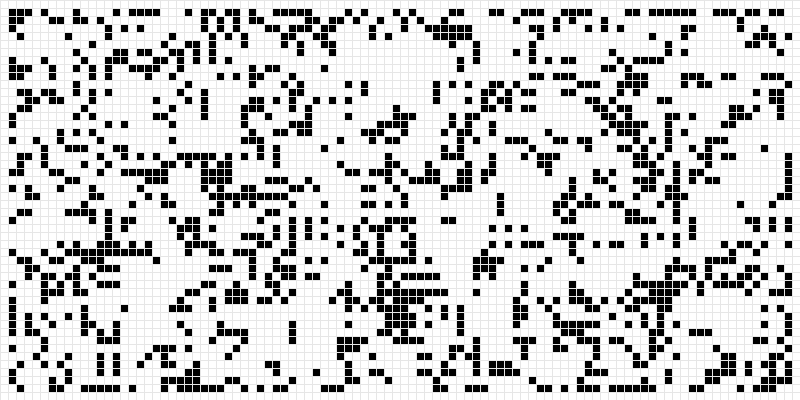

## Congrats you found it! Welcome to my GitHub

I’m a **Computer Science student at Michigan State University** who enjoys building software that is both highly functional and well-designed. My approach to programming is driven by curiosity and a focus on creating practical solutions—whether that means engineering a modular UI architecture for **Alchemy Software** or developing core full-stack features ground up with **GetAway**.

Beyond the screen, I’m a dedicated teammate and mentor. From building full-stack applications under tight deadlines at Spartahack to competing internationally with the MSU Underwater Hockey Club, I enjoy working in ***collaborative environments*** where people rely on each other to succeed and ideas can be tested.

I’m always looking to connect with folks who appreciate problem solving, smart automation, system design, and the occasional deep dive into music and nature

